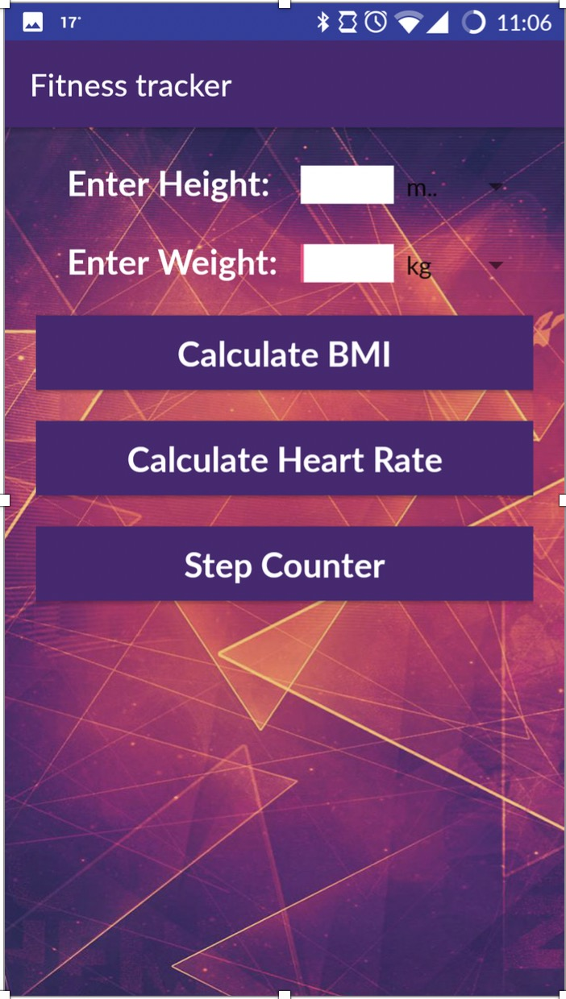
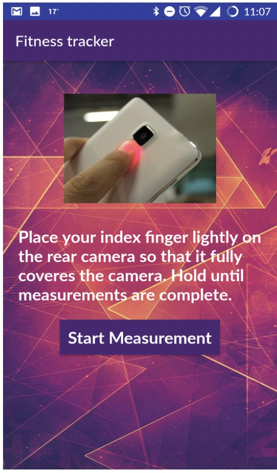
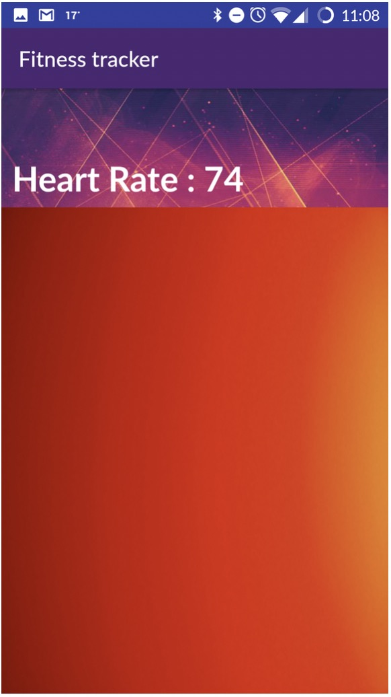
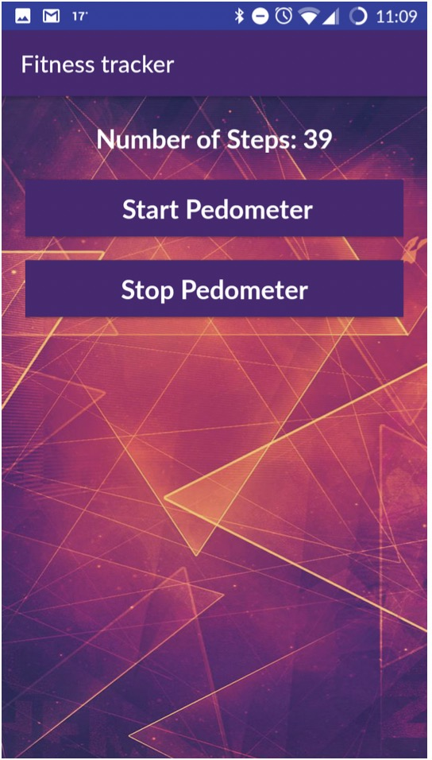

# FitnessTracker

## About Project

* This app is a tracking tool for your fitness, using which you can monitor your health.  
* The app calculates your BMI (Body mass index) by taking height and weight as input.
* It also suggests if you BMI is normal or not.
* Secondly the app calculates your heart rate by using camera and flashlight of your mobile phone. 
* No external equipment is needed other than your phone to monitor your heart rate. 
* Lastly the app can be used to monitor your physical activities by counting number of steps that you take each day and based on that it calculates the calories that you have burnt while walking.

## Calculate BMI:
{:height="50%" width="50%"}

## Calculate Heart Rate: 

## Step Counter:

